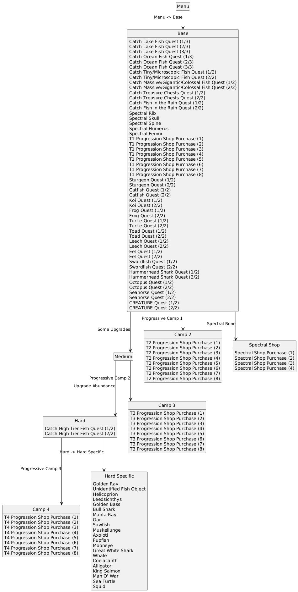
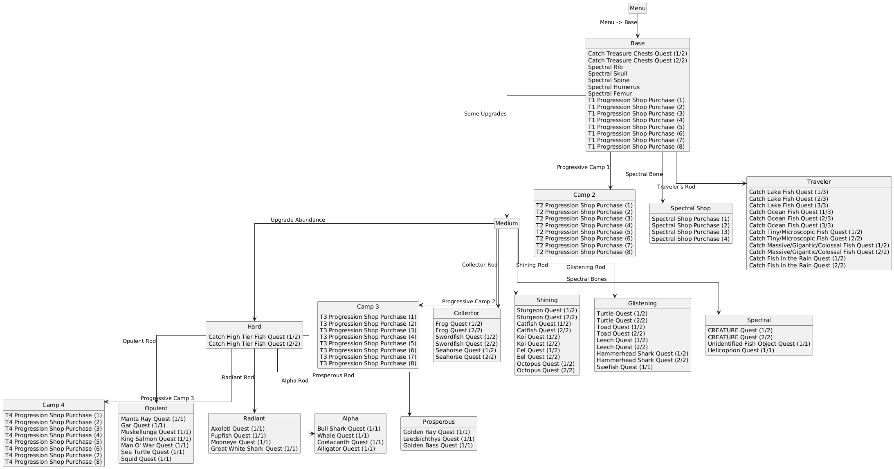

# WEBFISHING Archipelago
> [!CAUTION]  
> This mod is in an alpha state - there may still be bugs and frustrating item logic! Please play at your own risk!
## About
This is a mod for the game [WEBFISHING](https://store.steampowered.com/app/3146520/WEBFISHING/) that adds [Archipelago](https://archipelago.gg/) integration! The mod isn't feature-complete yet, but is hopefully in a working and mostly bug-free state!

In the current version, you can get checks from purchases and quests, and the receivable items consist of:
- Progressive rod/bait upgrades
- Progressive camp tier unlocks
- Lures
- Consumables (Drinks, scratch-offs, treasure chests)
- Money0
- Spectral bones

"Victory" can be set to either reaching a specified target rank, reaching a certain percentage journal completion, or by unlocking and purchasing the final camp tier.

This mod is multiplayer-compatible! You can fish alongside friends or strangers, regardless of whether or not they have the mod!

And a big thanks to [Eszenn](https://github.com/Eszenn) for letting me integrate their code into the mod!

## Connecting
With the mod installed, you can connect to an Archipelago server through the Archipelago button on the esc. menu once you load into a game. The button will open up a connection panel when pressed, which will let you enter all the relevant info.

When using the mod, you should **stick to one (new) save per Archipelago world.** If you receive items on the incorrect save, you can resolve the issue by quitting without saving - but checks sent from an incorrect save cannot be undone!

The client will try to send a notification if you lose connection - however you can make certain of a connection by entering a message in local chat.

## Installation
For world generation, go to the [releases](https://github.com/mwoiii/webfishing-ap/releases) page, download the ```apworld``` and ```YAML``` files, and place them in your ```custom_worlds``` and ```Players``` respectively (in your Archipelago installation folder!). From here, you can configure the YAML to your liking!

For the client, you can either:
- Install [r2modman](https://thunderstore.io/package/ebkr/r2modman/), and download the [Archipelago client](https://thunderstore.io/c/webfishing/p/mwmw/Archipelago/) from Thunderstore through it. This will automatically install all dependencies. (Recommended)

- Install [GDWeave](https://github.com/NotNite/GDWeave) manually, then download ```mwmw.Archipelago.zip``` from the [releases](https://github.com/mwoiii/webfishing-ap/releases) page and extract the folder into the GDWeave mods folder

## Logic
The logic for each of the gamemodes, 'Classic' and 'Harmonized', is outlined below. Due to the nature of the game, it is possible to skip ahead of the upgrade requirements - they are only there to ensure enough upgrades are in logic.

[Harmonized Rod Loot Tables](./loottables.md)


### Classic


### Harmonized

